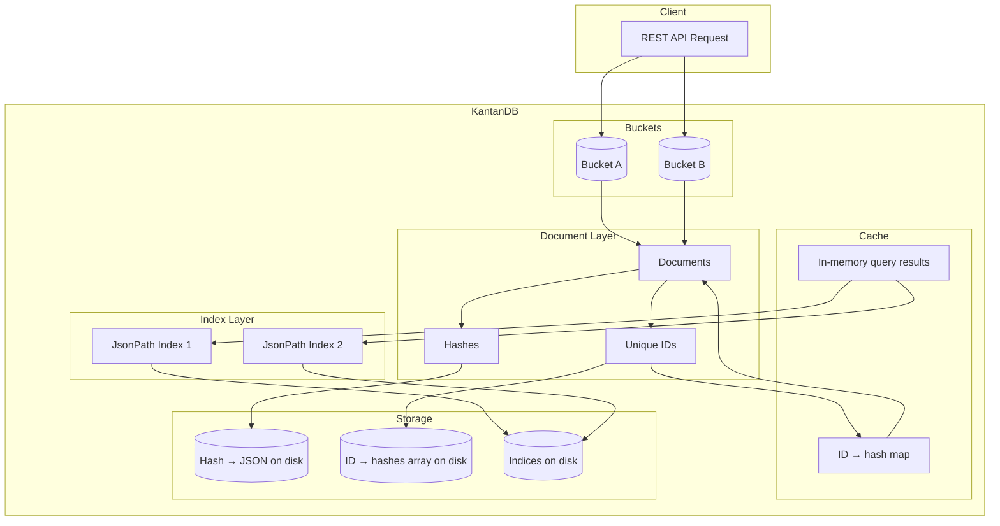
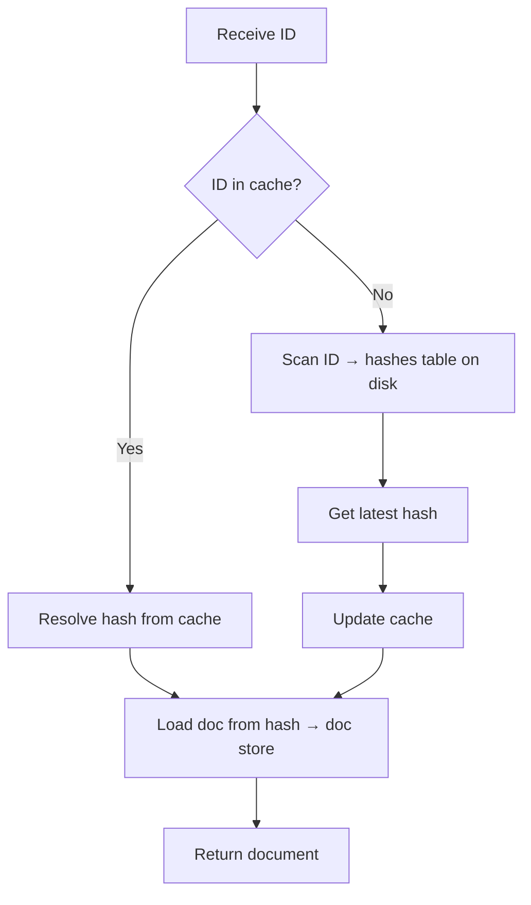
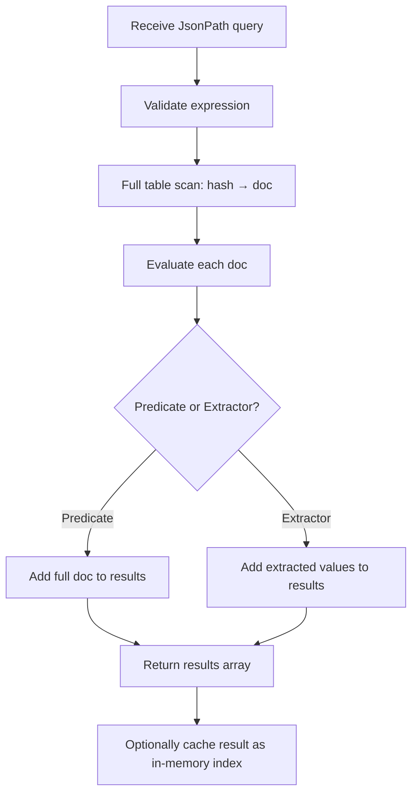
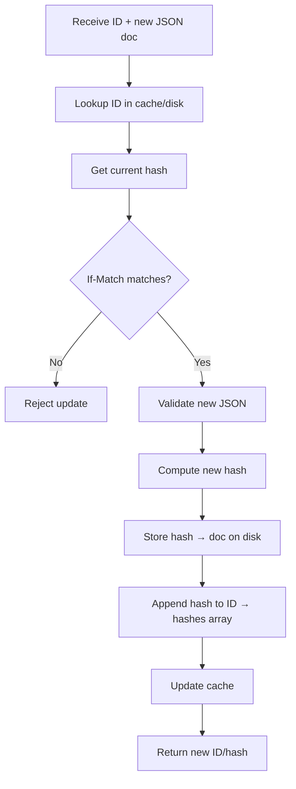
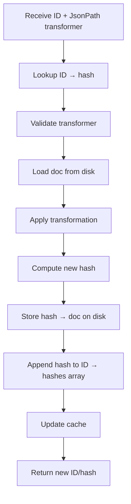
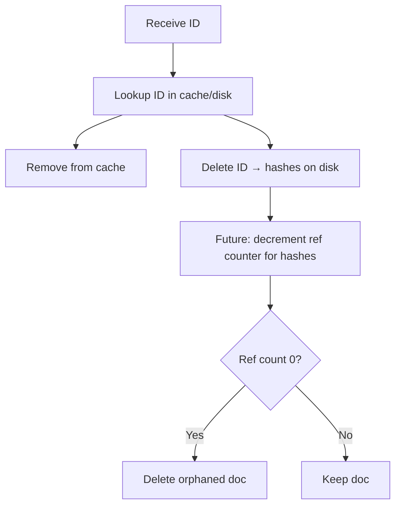
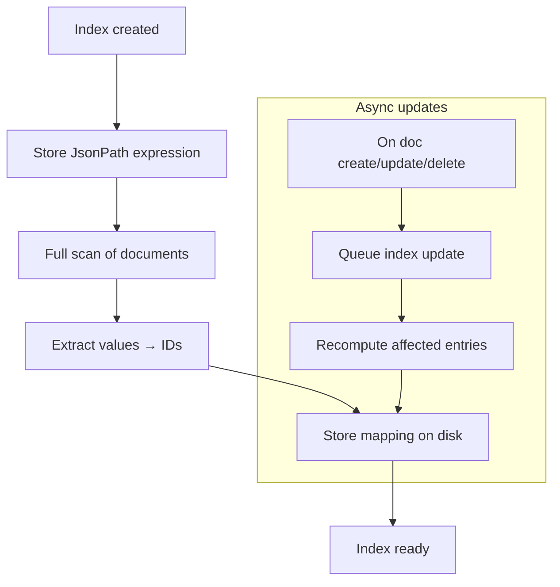

# KantanDB Technical Specifications

KantanDB is a **document-oriented NoSQL database** designed for learning and experimentation.

It is not intended to be production-ready, but rather a study project exploring database design, REST API development across multiple programming languages, and modern deployment practices.

## Overview



## Core Concepts

### Buckets

* A **bucket** is a logical container for documents.
* Buckets have:

  * A unique name.
  * A set of stored JSON documents.
  * A list of **JsonPath-based indexes**.

### Documents

* Each stored entity is a JSON document.
* Documents are automatically assigned a **unique ID** at insertion time.
* Clients do not provide custom keys.

### Indices

* A bucket can store multiple named indices built with **JsonPath expressions**.
* Each index maps document data extracted by its JsonPath expression.
* Indices speed up queries and document retrieval.

## API Specification

The KantanDB API is **OpenAPI-compliant** and exposed over HTTP/REST.

[openapi.yaml]

### Endpoints

#### Bucket Management

* `PUT /`

  * Create a new bucket.
  * Request body: `{ "name": "{bucket}" }`
* `GET /`

  * List all buckets.
* `DELETE /`

  * Remove a bucket and its documents.
  * Request body: `{ "name": "{bucket}" }`

#### Document Management

* `PUT /{bucket}`

  * Insert a new JSON document into a bucket.
  * Request body: A valid JSON document.
  * Returns a generated document ID.
* `POST /{bucket}`

  * Query JSON documents in a bucket.
  * Request body: JSONPath predicate or extractor, e.g. `{ "exp": "$.store.book[*].author" }`
  * Returns matching documents or extracted values.
* `GET /{bucket}/{id}`

  * Retrieve a document by its ID.
* `PUT /{bucket}/{id}`

  * Replace a document in a bucket with a new JSON document.
  * Request body: A valid JSON document.
  * Returns a generated document ID.
* `PATCH /{bucket}/{id}` *(optional)*

  * Apply a JSONPath-based transformation to a document and replace it with the result.
  * Request body: JSONPath transformer.
* `DELETE /{bucket}/{id}`

  * Delete a document by its ID.

#### Index Management

* `PUT /{bucket}/{index_name}`

  * Create a new index on a JsonPath expression.
  * Request body: `{ "exp": "$.user.id" }`
* `GET /{bucket}/{index_name}`

  * Return matching documents or extracted values.
* `DELETE /{bucket}/{index_name}`

  * Remove an index.

#### Default Indices

* On bucket creation, two default indices are created:

  * `/{bucket}/idx` → returns all IDs of inserted documents.
  * `/{bucket}/indices` → returns a list of all created indices.

#### Naming Clashes

* Index names must not conflict with automatically generated document IDs, which are either UUIDv7 or Snowflake IDs.

## Data Model

### Document Metadata

Each document is stored as:

* A key–value pair of its **murmur hash → raw JSON body**, enabling deduplication and immutability.
* A key–value pair of **unique ID → array of hashes**, allowing versioning and history tracking.

  * Unique IDs are either Snowflake IDs or UUIDv7, both sortable.

### Index Structure

* An index stores:

  * The JsonPath expression.
  * A mapping of extracted values → document IDs.

## Querying

* Queries are expressed as **JsonPath expressions**.
* Queries can:

  * Return entire documents.
  * Return transformed results (specific fields, arrays, values).

## Implementation Details

### Document Operations

#### Create

1. Validate the input as a proper JSON object.
2. Compute its murmur hash.
3. Check whether the hash already exists to avoid duplicates (collisions are possible but ignored in the first version).
4. Store the hash → document mapping on disk.
5. Generate a unique ID and store it as ID → `[hash]`.
6. Add ID → hash mapping to the cache.

```mermaid
flowchart TD
    A[Receive JSON doc] --> B[Validate JSON]
    B --> C[Compute murmur hash]
    C --> D{Hash exists?}
    D -- Yes --> E[Skip storing /duplicate/]
    D -- No --> F[Store hash → doc on disk]
    F --> G[Generate unique ID]
    G --> H[Store ID → [hash] on disk]
    H --> I[Add ID → hash to cache]
    I --> J[Return ID]
```

#### Read

1. Lookup by ID in the cache.
2. If found, resolve to the murmur hash and fetch the document from disk.
3. If not in cache, scan the IDs table on disk, get the latest hash, add it to the cache, then load the document.



#### Query

1. Validate the incoming JsonPath expression.
2. Perform a full table scan of hash → document mappings on disk.
3. Evaluate each document against the query.

   * If the query is a predicate, return the whole document.
   * If the query is an extractor, return only the matching values.
4. Build the response array and return it.



**Future optimization:**

* Cache results as in-memory indices with TTL.
* Keep them updated lazily, similar to on-disk indices.

#### Update

1. Lookup the ID in cache or on disk.
2. Verify the current hash matches the request’s `If-Match` header.
3. If matched, process the new JSON as in *Create*.
4. Append the new hash to the ID → hashes array on disk.
5. Update the cache with ID → new hash.



#### Patch

1. Lookup the ID in cache or on disk.
2. Validate the provided JsonPath transformation.
3. Load the document for the latest hash.
4. Apply the transformation, compute a new hash.
5. Store the new document as in *Update*.



#### Delete

1. Lookup the ID in cache or on disk.
2. Remove the ID from cache.
3. Delete its record from disk.



**Future work:**

* Implement compaction via reference counting.

  * Option A: maintain a table of hash → reference count; delete documents when count reaches 1.
  * Option B: track deleted IDs in a compaction table and process asynchronously.

### Indices

* An index is essentially a stored query plus its results.
* It is created by scanning all documents once and persisting the extracted values → IDs mapping.
* Updates happen asynchronously through a queue, so indices may lag behind (eventual consistency).



### Minimal Viable Product

* First version:

  * Support basic document CRUD.
  * Queries always performed dynamically (no cache).
* Next iterations:

  * Add in-memory index cache.
  * Later move to persistent on-disk indices.

## Deployment & Runtime

* Each implementation should expose the REST API via HTTP.
* Security is out of scope initially but a long-term goal (e.g. per-bucket/doc ACLs).
* Multi-tenancy is a potential extension, closely tied to security.
* Logging, telemetry, and control plane features are future goals.
* Storage engines:

  * In-memory (default).
  * File-backed (JSON or KV store).
  * SQLite or embedded DB for experimentation.

## Non-Goals

* High availability, clustering, or distributed features.
* Complex transaction semantics.
* Production-grade optimizations.
